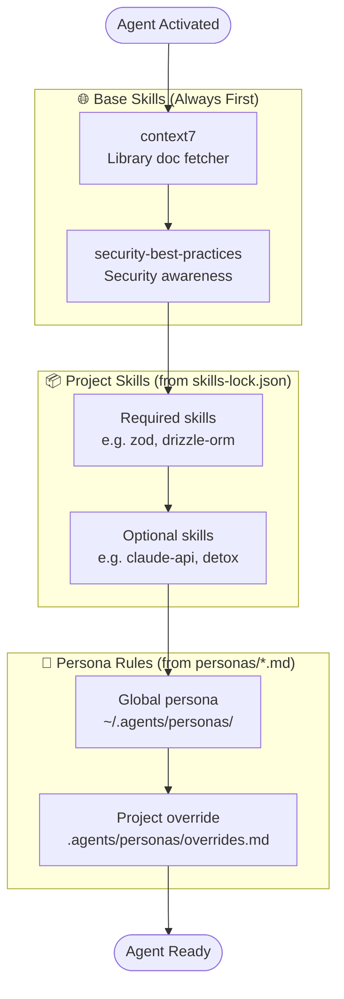

# Base Skills — Global Agent Defaults

This document defines the **base skill layer**: skills that every agent should load before reading project-specific configuration. These skills give agents enough general context to understand *any* project without relying on project-local overrides.

---

## What Are Base Skills?

Base skills are globally-required knowledge modules that:
1. Apply to every project regardless of stack or domain
2. Prevent the most common agent mistakes (security holes, bad docs usage, broken imports)
3. Are the **first thing loaded** — before project skills, before personas, before registry config

Think of them as the "operating system" every specialist runs on.

---

## The Base Skill Set

| Skill | Why It's Universal |
|---|---|
| `context7` | Every agent needs to fetch up-to-date library docs before using any API. Prevents hallucinating deprecated method signatures. |
| `security-best-practices` | Security is never optional. Applies to every layer: backend, frontend, mobile, AI, and tooling. |

> **Important Note:** This boilerplate does *not* bundle these skills. You must install them manually (e.g., from [agentskills.io](https://agentskills.io)) into your project's local `.agents/skills/` directory.

These two skills are **enforced by `validate-registry.js`** — if they are missing from your project, the validator will raise a warning.

---

## Loading Order



---

## Why `context7` Is Non-Negotiable

Without `context7`, agents use training-data knowledge of library APIs — which can be months or years out of date. Common symptoms:

- Recommending removed or renamed APIs
- Missing new features that would solve the problem better
- Generating code that fails at runtime despite looking correct

**Rule**: Before using any external library in a task, use `context7` to verify the current API signature.

---

## Why `security-best-practices` Is Non-Negotiable

Security issues cross every layer. Examples by specialist:

| Specialist | Security risk without the skill |
|---|---|
| `be-architect` | SQL injection, missing auth middleware, exposed secrets |
| `web-architect` | XSS, CSRF, unsafe innerHTML, open redirects |
| `mobile-architect` | Insecure storage, cleartext network, unprotected deep links |
| `ai-bridge-specialist` | PII leakage to cloud providers, prompt injection |
| `git-specialist` | Committing secrets, unprotected branches, force-push |
| `shared-type-architect` | Loose schemas accepting any input |

**Rule**: Security review is mandatory in every implementation summary, not optional.

---

## Adding New Base Skills

To propose a new base skill:
1. The skill must be **universally applicable** — not just useful for one stack.
2. Add it to `required` in every project's `skills-lock.json`.
3. Update this document.
4. Update the `validate-registry.js` `baseRequired` array to enforce it.

Current candidates under consideration:
- `conventional-commits` — commit message standards apply to every git-using project
- `typescript-patterns` — if the team is TypeScript-only across all projects

---

## Project-Specific Skills

Everything beyond the base layer is configured per-project in `skills-lock.json`:

```json
{
  "required": [
    "context7",
    "security-best-practices",
    "zod",
    "drizzle-orm"
  ],
  "optional": [
    "sqlite-database-expert",
    "claude-api"
  ]
}
```

The `init-project.js` script generates this file automatically based on your workspace types.
