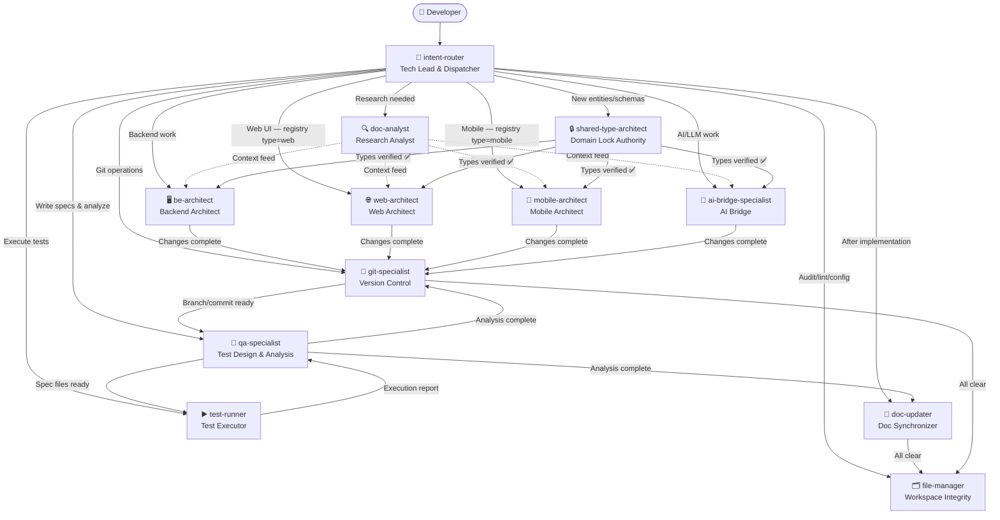
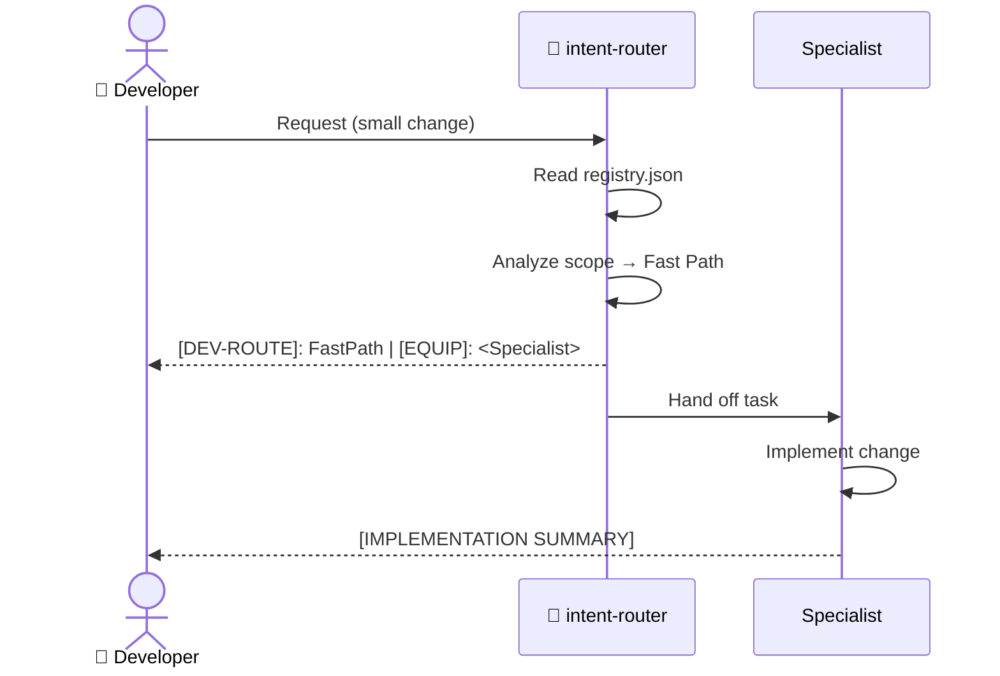
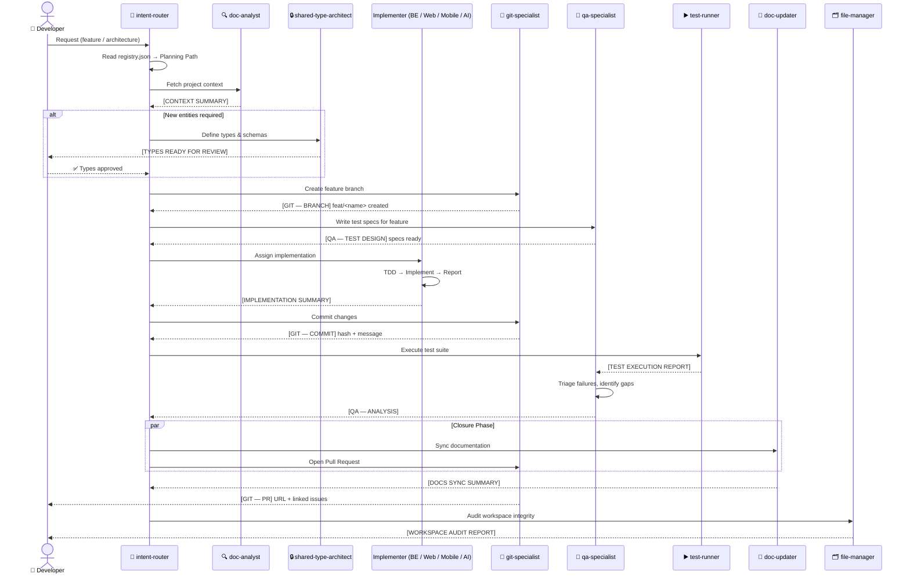
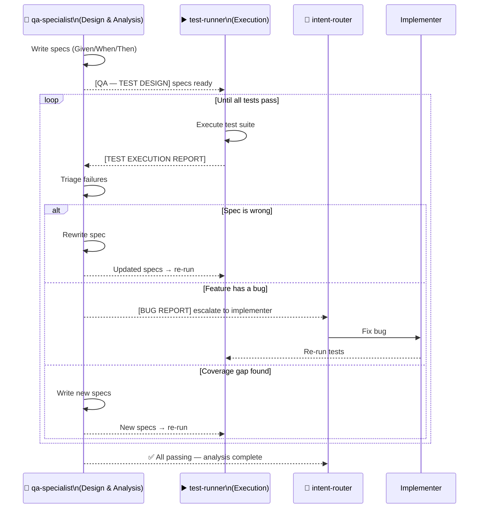
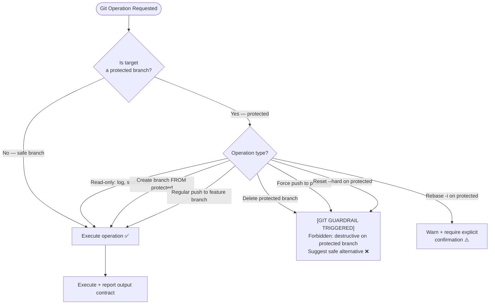
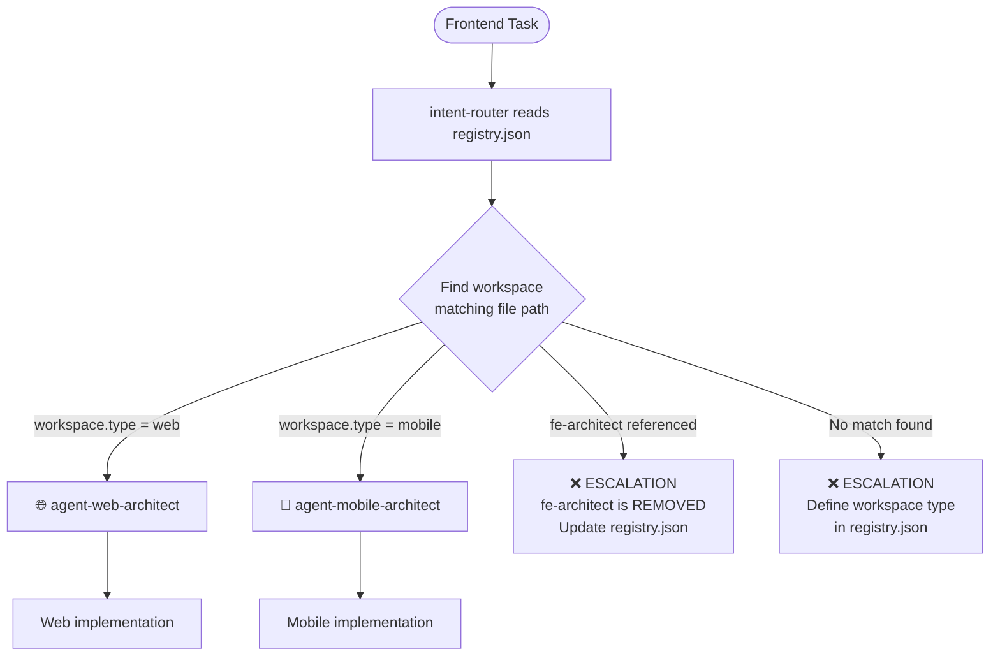
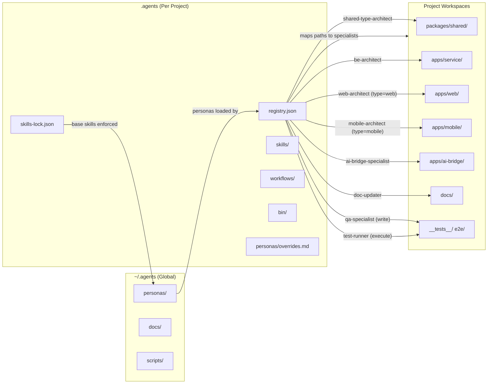
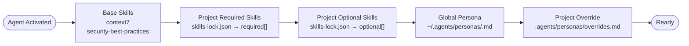

# Orchestration Flow

Visual diagrams showing how agents collaborate across a full development lifecycle.

---

## 1. High-Level Agent Ecosystem

---

## 2. Fast Path Flow (Single-File Edits)

---

## 3. Planning Path Flow (Multi-File / Feature Work)

---

## 4. QA ↔ Test Runner Collaboration Loop

---

## 5. Git Specialist — Guardrail Decision Tree

---

## 6. Frontend Dispatch — Registry-Driven Routing

---

## 7. Workspace Boundary Map

---

## 8. Skill Loading Order

