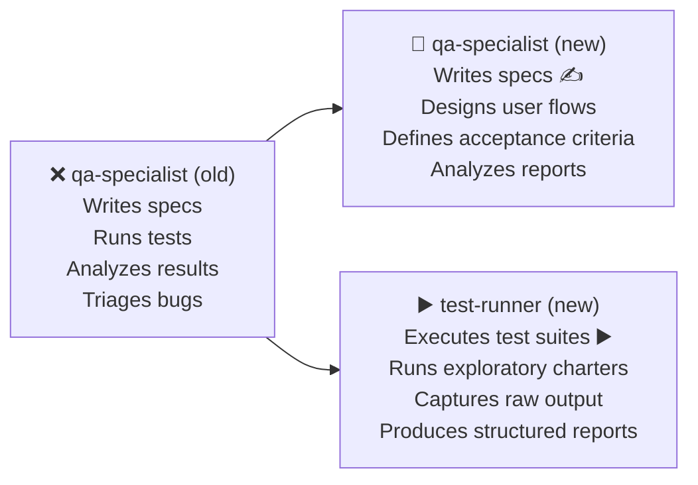
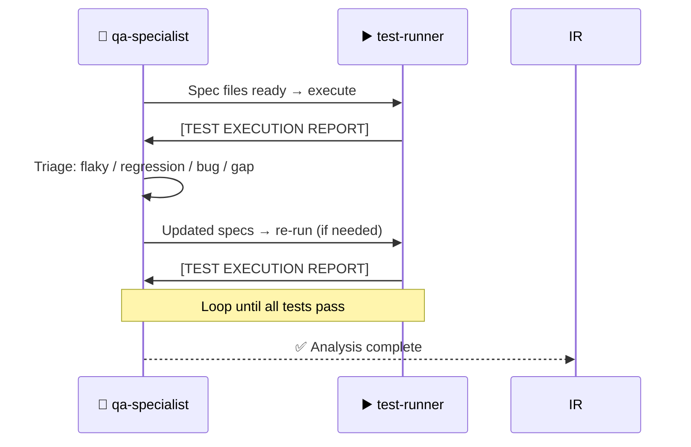

# Persona Split Decisions — Decision Log

Records all architectural decisions about persona splits, removals, and creations.

---

## Decision 1: `fe-architect` → `web-architect` + `mobile-architect`

**Date**: 2026-05-02  
**Status**: ✅ Complete — `fe-architect.md` deleted

### Problem
The original `agent-fe-architect` was built for React Native 0.84 with LiveRubber-specific design system references. When generalized to be project-agnostic it gave incorrect guidance to both web and mobile targets.

### Why Web and Mobile Are Fundamentally Different

| Dimension | `agent-web-architect` | `agent-mobile-architect` |
|---|---|---|
| **Rendering** | DOM / Virtual DOM | Native views via bridge / JSI |
| **Styling** | CSS, CSS Modules, Tailwind | StyleSheet API — no CSS |
| **Animation** | CSS transitions, Framer Motion, GSAP | Reanimated worklets (off JS thread) |
| **Navigation** | URL-based routing | Stack/Tab/Drawer (react-navigation) |
| **Performance** | Bundle size, SSR/SSG, Core Web Vitals | JS thread budget, FPS, bridge overhead |
| **Offline** | Service Workers (optional) | Required — no reliable network |
| **Platform** | Chrome, Firefox, Safari | iOS + Android (native APIs differ) |
| **Build** | Webpack, Vite, Turbopack | Metro, Gradle, Xcode |
| **Testing** | Playwright, Cypress, Vitest | Detox, RNTL, Jest with native mocks |
| **Design system** | WCAG 2.1 AA, responsive breakpoints | Platform HIG (iOS) + Material (Android) |

### Dispatch Mechanism
The `agent-intent-router` reads `registry.json` workspace `"type"` field:
- `"type": "web"` → `agent-web-architect`
- `"type": "mobile"` → `agent-mobile-architect`

### Impact

| | Before | After |
|---|---|---|
| Personas (FE area) | 1 generic (`fe-architect`) | 2 specialized (`web-architect` + `mobile-architect`) |
| Dispatch logic | Hardcoded path | Registry-driven by `"type"` field |
| Project-specific bleed | High (LR references in persona) | None (all config in `registry.json`) |
| Guidance accuracy | ~70% correct per target | ~95% correct per target |
| `fe-architect.md` | Present (deprecated stub) | **Deleted** |

---

## Decision 2: `qa-specialist` → `qa-specialist` + `test-runner`

**Date**: 2026-05-02  
**Status**: ✅ Complete

### Problem
The original `agent-qa-specialist` was overloaded — it was responsible for:
1. Writing test specifications
2. Designing user flows and acceptance criteria
3. Running test commands
4. Analyzing results
5. Triaging failures

This caused two issues:
- **Context confusion**: Writing code (spec files) and executing commands are fundamentally different cognitive modes and tool permissions.
- **Feedback loop**: When tests failed, the agent had to switch between "executor" and "analyst" roles in the same context, losing the clean input → analysis chain.

### The Split

### Why the Separation Makes Sense

| Concern | `agent-qa-specialist` | `agent-test-runner` |
|---|---|---|
| **Write access** | `*.spec.ts`, `*.test.ts`, `e2e/` | **None** — read + execute only |
| **Cognitive mode** | Analytical, design-thinking | Procedural, execution-focused |
| **Trigger** | Feature change / bug report / coverage gap | "Run the tests" |
| **Output** | Spec files, user flow docs, bug reports | Raw execution reports |
| **Feedback loop** | Receives reports, triages, writes new specs | Receives specs, executes, reports back |

### Feedback Loop Design

### Impact

| | Before | After |
|---|---|---|
| QA agents | 1 (overloaded) | 2 (focused) |
| Spec writing | Mixed with execution | `qa-specialist` only |
| Test execution | Mixed with analysis | `test-runner` only |
| Result analysis | Blended into execution | Clean handoff: runner → analyst |
| Exploratory testing | Not formalized | Structured charter format in `test-runner` |
| Smoke tests | Not defined | Dedicated mode in `test-runner` |
