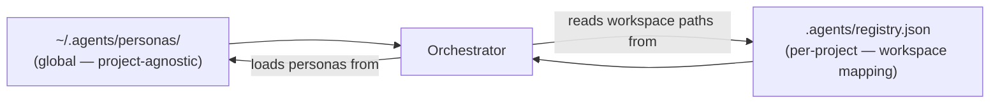

# Project Configuration Guide

How to configure a new project to use the global `~/.agents` persona system.

---

## Overview

The global `~/.agents/personas/` directory defines **what each specialist knows and how they behave**. Each project must configure **where** those specialists operate via a local `.agents/registry.json`.



---

## Step 1 — Create the project's `.agents/` directory

```bash
mkdir -p <project-root>/.agents/{skills,workflows,bin}
```

---

## Step 2 — Create `registry.json`

This file maps workspace paths to specialist personas and configures project-specific settings.

```jsonc
{
  "$schema": "https://agents.schema/registry/v1",
  "project": {
    "name": "my-project",
    "description": "Short description of the project domain",
    "root": ".",
    "packageManager": "bun",          // "bun" | "npm" | "pnpm" | "yarn"
    "testRunner": "bun:test",         // "bun:test" | "jest" | "vitest" | "detox"
    "linter": "bun biome check --write ."
  },
  "workspaces": {
    "shared": {
      "path": "packages/shared/",
      "specialist": "agent-shared-type-architect"
    },
    "backend": {
      "path": "apps/service/",
      "specialist": "agent-be-architect"
    },
    "web": {
      "path": "apps/web/",
      "specialist": "agent-web-architect"
    },
    "mobile": {
      "path": "apps/mobile/",
      "specialist": "agent-mobile-architect",
      "config": {
        "framework": "react-native",   // "react-native" | "expo-managed" | "expo-bare"
        "version": "0.84"
      }
    },
    "ai": {
      "path": "apps/ai-bridge/",
      "specialist": "agent-ai-bridge-specialist",
      "config": {
        "localProvider": "ollama",
        "localProviderUrl": "http://localhost:11434",
        "cloudProvider": "gemini"
      }
    },
    "docs": {
      "path": "docs/",
      "specialist": "agent-doc-updater"
    }
  },
  "permissions": {
    "agent-file-manager": {
      "allowedRoots": [".", ".agents/"],
      "lintCommand": "bun biome check --write ."
    },
    "agent-qa-specialist": {
      "testCommand": "bun test",
      "e2eCommand": "bunx playwright test"
    }
  }
}
```

> **Note**: Only include the workspaces that exist in the project. A mobile-only project omits `web`. A web-only project omits `mobile`.

---

## Step 3 — Adapt skills for the project

The project-local `.agents/skills/` directory holds skills specific to this project's stack. Global skills (in the LiveRubber workspace) do not automatically transfer.

```
.agents/
  skills/
    zod/             ← add if using Zod
    drizzle-orm/     ← add if using Drizzle
    context7/        ← recommended for all projects
```

---

## Step 4 — Create `skills-lock.json`

This file locks the skills required for this project. The `agent-file-manager` cross-references it at audit time.

```json
{
  "required": [
    "context7",
    "zod",
    "security-best-practices",
    "nodejs-backend-patterns"
  ],
  "optional": [
    "drizzle-orm",
    "sqlite-database-expert"
  ]
}
```

---

## Step 5 — Validate the setup

Run the `agent-file-manager` persona to validate the registry:

```
[EQUIP]: agent-file-manager
Task: Validate .agents/registry.json and skills-lock.json for <project-name>
```

---

## Minimal Configuration (Monorepo vs. Single-App)

### Monorepo (shared types + multiple apps)
Use the full `workspaces` map with `shared` pointing to your types package.

### Single Web App
```json
{
  "workspaces": {
    "app": { "path": "src/", "specialist": "agent-web-architect" },
    "docs": { "path": "docs/", "specialist": "agent-doc-updater" }
  }
}
```

### Single Mobile App
```json
{
  "workspaces": {
    "app": {
      "path": "src/",
      "specialist": "agent-mobile-architect",
      "config": { "framework": "expo-managed", "version": "52" }
    },
    "docs": { "path": "docs/", "specialist": "agent-doc-updater" }
  }
}
```

---

## Reference: Persona → Skills Matrix

| Persona | Always-On Skills | Optional Skills |
|---|---|---|
| `intent-router` | — | — |
| `doc-analyst` | `context7` | — |
| `shared-type-architect` | `security-best-practices`, `zod` | `drizzle-orm`, `sqlite-database-expert` |
| `be-architect` | `nodejs-backend-patterns`, `security-best-practices` | `mcp-builder`, `claude-api`, `sqlite-database-expert`, `drizzle-orm` |
| `web-architect` | `ui-component-patterns`, `security-best-practices` | `jotai-expert`, `tanstack-start-best-practices`, `context7` |
| `mobile-architect` | `react-native-best-practices`, `vercel-react-native-skills`, `ui-component-patterns` | `upgrading-react-native`, `react-native-design`, `mobile-android-design`, `jotai-expert`, `mobile-offline-support`, `sqlite-database-expert` |
| `ai-bridge-specialist` | `nodejs-backend-patterns`, `security-best-practices` | `claude-api`, `mcp-builder` |
| `doc-updater` | `context7` | — |
| `file-manager` | `nodejs-backend-patterns`, `security-best-practices` | `validate-skills` |
| `qa-specialist` | — | (project-configured test runner) |
